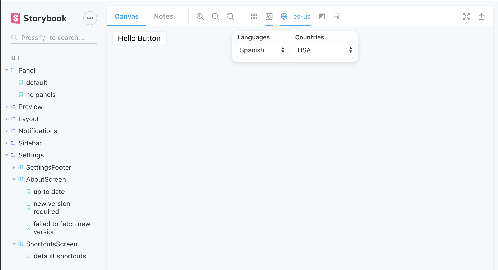

# Storybook I18n Addon
A framework/library/implementation agnostic I18n addon for storybook


## Configuration

Then create a file called `addons.js` in your storybook config.

Add following content to it:

```js
import '@storybook/addon-i18n/register';
```

## Usage

You can add the I18n countries and languages to all stories with `addParameters` in `.storybook/config.js`:

```js
import { addParameters } from '@storybook/react'; // <- or your storybook framework

addParameters({
   i18n: {
        languages: [
            { name: 'English', value: 'en', default: true },
            { name: 'Spanish', value: 'es' },
            { name: 'German', value: 'de' },
        ],
        countries: [
            { name: 'USA', value: 'us', default: true },
            { name: 'Canada', value: 'ca' },
            { name: 'United Kingdom', value: 'uk' },
        ],
        callback: (language, country) => {
            console.log('Callback:', language, country);
        },
    },
});
```